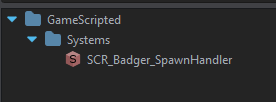
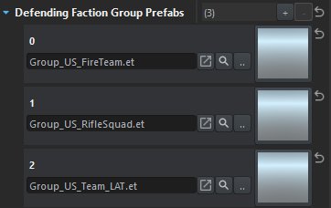
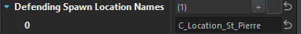
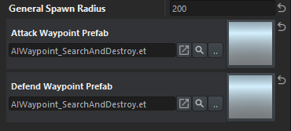

# Placable Entity

I wanted to create a configurable `Spawn Handler` which would *maintain* a certain number of units per `faction` overtime. 

In order for my `class` to appear in the `Resource Browser` I did the following:

## Created SCR_Badger_SpawnHandler

Now I'm not entirely sure why we need a class variant AND a plain version but.... I saw a pattern. I followed it....

```csharp
class SCR_Badger_SpawnHandlerClass : GenericEntityClass
{

};

class SCR_Badger_SpawnHandler : GenericEntity
{

};
```

## Resource Browser
To specify where this entity is viewed within the `Resource Browser` I had to add the following attribute to the class variant

```csharp
[EntityEditorProps(category: "GameScripted/Systems", description: "Entity which manages AI" )]
class SCR_Badger_SpawnHandlerClass : GenericEntityClass
{

};
```



## Editor-Driven Values

Believe we can all agree that hardcoded values are no fun. As a mission-maker you want to swap stuff out on the fly! In my
scenario I wanted 2 sides where I can define the following:

- Faction Key
- General number of units to maintain for this faction
- Group prefabs to spawn
- Locations for these groups to spawn at
- Waypoint Prefab to use for said faction

The Enfusion Engine allows us to specify how to expose/edit a particular value in our scripts! From a picker to a simple textbox. 

**Note**: all the code shown will be within the SpawnHandler, not the SpawnHandlerClass.

### Faction Key
```csharp
[Attribute("", UIWidgets.EditBox, desc: "Name of the defending faction")]
private FactionKey m_DefendingFactionKey;
```


This faction key is defined by the `FactionManager` that you have loaded in the world scene. So as long as this matches with one of the listed factions you're good.

### Count
```csharp
[Attribute("", UIWidgets.Range, desc: "Amount of defending units")]
private int m_DefendingSideCount;
```


Probably doesn't need to be a range? Also not sure how to declare a min/max value for it yet.

### Group Prefabs
```csharp
[Attribute("", UIWidgets.ResourcePickerThumbnail, "Prefab to be spawned", params: "et")]
private ref array<ResourceName> m_DefendingFactionGroupPrefabs;
```



The params value allows us to limit files with the `et` file extension. Though it doesn't necessarily limit the type of prefab... better than nothing right? 

Additionally, `ResourceName` is essentially the path to the file. I guarantee you... writing these paths by hand is not fun. When it comes time to load the prefab we'll use the `Resource.Load` function.

### Spawn Locations

Personally, in previous Arma games I used the map config to dynamically load/find map locations. However I don't know how or even IF that is a thing anymore. From existing code it appears finding things via `EntityName` is one approach. Thus an array of strings is needed. On load we'll grab all entities via name so we have them on hand later.

```csharp
[Attribute("", UIWidgets.EditBox)]
private ref array<string> m_DefendingSpawnLocationNames;
```



### General

Of course whatever is done for the defending side was duplicated for the attacking side as well. 

```csharp
[Attribute("", UIWidgets.EditBox)]
private int m_GeneralSpawnRadius;

[Attribute("", UIWidgets.ResourcePickerThumbnail, desc: "Pick Waypoint prefab for attackers")]
private ResourceName m_AttackWaypointPrefab;

[Attribute("", UIWidgets.ResourcePickerThumbnail, desc: "Pick Waypoint prefab for defenders")]
private ResourceName m_DefendWaypointPrefab;
```



As you can probably notice is the two waypoints are the same BUT that's the beauty of configurable values... we can swap the AI behavior out without modifying our code!

### Local values
There are a few things we need to load at startup, as well as track during the lifetime of our handler.

First, we need a way to track how many AI are on the map so we need 2 variables, 1 per side.

```csharp
private int m_CurrentDefendingEntityCount = 0;
private int m_CurrentAttackingEntityCount = 0;
```

Additionally, we need the actual entities associated with our spawn locations. Spawn points will be a random position around these locations.

```csharp
private ref array<IEntity> defendingSpawnLocations = {};
private ref array<IEntity> attackingSpawnLocations = {};
```

Also, to get a random point in an area we can use the `RandomGenerator` which unfortunately can't give a random number? Perhaps something else has it but for now I've been using an array of numbers to use when figuring out how many groups to spawn at a time.

Lastly, we'll want a reference to our world...

```csharp
private ref array<int> spawnCounts = { 1, 2, 3, 4, 5, 6, 7 };
private ref RandomGenerator random;
private BaseWorld world;
```

### Initialization
When we start the game we need a way to kick off our code as well as initilize things. Furthermore we want to make sure things don't break while we're in the editor. 

```csharp
void SCR_Badger_SpawnHandler(IEntitySource src, IEntity parent)
{
    SetEventMask(EntityEvent.INIT);
    Activate();
}

protected override void EOnInit(IEntity owner)
{
    if(!GetGame() || !GetGame().GetWorld())
        return;

    world = GetGame().GetWorld();
    random = new RandomGenerator();

    Print("Loading locations...");
    LoadLocations();

    Print("Starting SpawnHandler Loop...");
    SpawnLoop();
}
```

This is enough to get our stuff going! If we're in the editor the `world` is technically "not loaded" so this will prevent our code from executing until the game's actually running. 

### Load Locations
```csharp
void LoadLocations()
{
    // This should be straight forward. We're only adding entities that were found to their
    // corresponding arrays
    foreach(string name : m_DefendingSpawnLocationNames)
    {
        IEntity location = world.FindEntityByName(name);
        if(location) // if found
            defendingSpawnLocations.Insert(location);
    }

    foreach(string name : m_AttackingSpawnLocationNames)
    {
        IEntity location = world.FindEntityByName(name);
        if(location) // if found
            attackingSpawnLocations.Insert(location);
    }
}
```

### Spawn Loop
```csharp
void SpawnLoop()
{
    // Spawn only if we haven't capped out
    if(m_CurrentDefendingEntityCount < m_DefendingSideCount)
    {
        int count = spawnCounts.GetRandomElement();
        for(int i = 0; i < count; i++)
        {
            ResourceName prefab = m_DefendingFactionGroupPrefabs.GetRandomElement();
            IEntity entityLocation = defendingSpawnLocations.GetRandomElement();
            Spawn(prefabName, location, false);
        }        
    }

    if(m_CurrentAttackingEntityCount < m_AttackingSideCount)
    {
        int count = spawnCounts.GetRandomElement();
        for(int i = 0; i < count; i++)
        {
            ResourceName prefab = m_AttackingFactionGroupPrefabs.GetRandomElement();
            IEntity entityLocation = attackingSpawnLocations.GetRandomElement();
            Spawn(prefabName, location, true);
        }        
    }

    // Call later uses milliseconds (1000 for 1 second)
    // So this means in 2 minutes this loop will get called again
    // Thus making a recursive method
    GetGame().GetCallqueue().CallLater(SpawnLoop, 120 * 1000, false);

    // Update the local counts
    CountSides();
}
```

### Spawn
```csharp
void Spawn(ResourceName prefab, IEntity spawnPoint, bool isAttacking=true)
{
    if(!world || prefab.IsEmpty())
        return false;

    Resource resource = Resource.Load(prefab);
    EntitySpawnParams params();

    // position of spawn point
    vector mat[4];
    spawnPoint.GetWorldTransform(mat); // outputs the transform into our vector

    // we need to generate a random position in area
    vector position = mat[3];
    position = random.GetnerateRandomPointInRadius(10, m_GeneralSpawnRadius, position);

    // Ensure the position is snapped to the ground
    position[1] = spawnPoint.GetWorld().GetSurfaceY(position[0], position[2]);
    mat[3] = position;

    // update our spawn params
    params.TransformMode = ETransformMode.WORLD;
    params.Transform = mat;

    // Our prefabs should be groups of AI. 
    SCR_AIGroup group = SCR_AIGroup.Cast(GetGame().SpawnEntityPrefab(resource, world, params));

    if(!group)
        return false;
    
    group.SetFlags(EntityFlags.VISIBLE, true);
    SetWaypointFor(group, isAttacking);
    return true;
}
```

### Waypoint Creation and Assignment
```csharp
AIWaypoint CreateWaypoint(ResourceName waypointPrefab)
{
    Resource resource = Resource.Load(waypointPrefab);

    if(!resource)
        return null;

    AIWaypoint wp = AIWaypoint.Cast(GetGame().SpawnEntityPrefab(resource));
    return wp;
}

void SetWaypointFor(SCR_AIGroup group, bool isAttacking=true)
{
    IEntity randomLocation = defendingSpawnLocations.GetRandomElement();
    AIWaypoint waypoint;

    if(isAttacking)
        waypoint = CreateWaypoint(m_AttackWaypointPrefab);
    else
        waypoint = CreateWaypoint(m_DefendWaypointPrefab);

    if(!waypoint)
    {
        Print("Error creating waypoint", LogLevel.WARNING);
        return;   
    }
    
    // We could apply similar random positioning here if we wanted
    waypoint.SetOrigin(randomLocation.GetOrigin());
    group.AddWaypoint(waypoint);    
}
```

### Count Sides
```csharp
void CountSides()
{
    ref private array<AIAgent> entities = {};
    AIWorld aiWorld = GetGame().GetAIWorld();
    aiWorld.GetAIAgents(entities);

    m_CurrentDefendingEntityCount = 0;
    m_CurrentAttackingEntityCount = 0;

    foreach(AIAgent agent : entities)
    {
        // Appears the AI component is this so if we can successfully cast / find this on our agent we're good!
        SCR_ChimeraAIAgent chimera = SCR_ChimeraAIAgent.Cast(agent.FindComponent(SCR_ChimeraAIAgent));

        if(!chimera)
            continue;

        if(chimera.GetFaction(agent).GetFactionKey() == m_AttackingFactionKey)
            m_CurrentAttackingEntityCount += 1;
        else if(chimera.GetFaction(agent).GetFactionKey() == m_DefendingFactionKey)
            m_CurrentDefendingEntityCount += 1;
    }
}
```