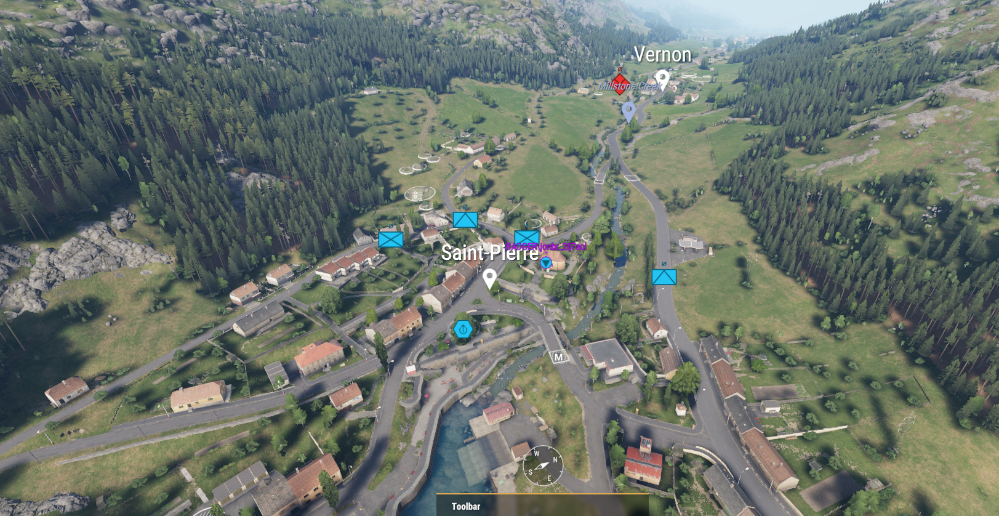
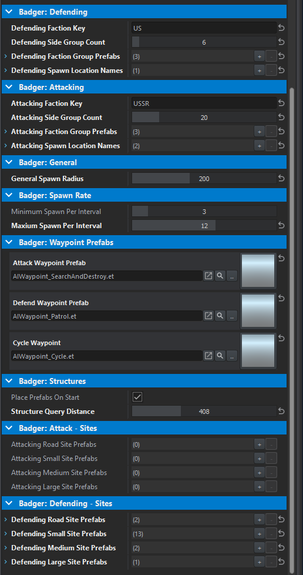
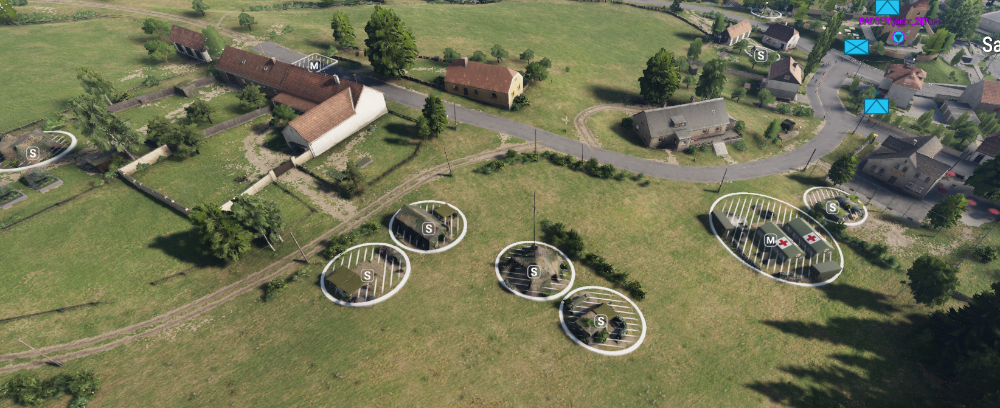
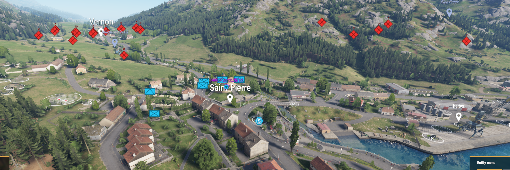

# Spawn Handler

## Overview

Basic attack/defend scenario

## Editor Properties

Multiple attributes are exposed so you can tweak this scenario to your liking without modifying code!

## Sites

If applicable, site-slots will randomly be filled with compositions you provided!

Sites near a spawn point are selected

## Spawning

Both friendly and enemy forces will spawn randomly around provided spawn locations.

## Source Code
[Source Code](SpawnHandlerCode.md)