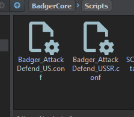
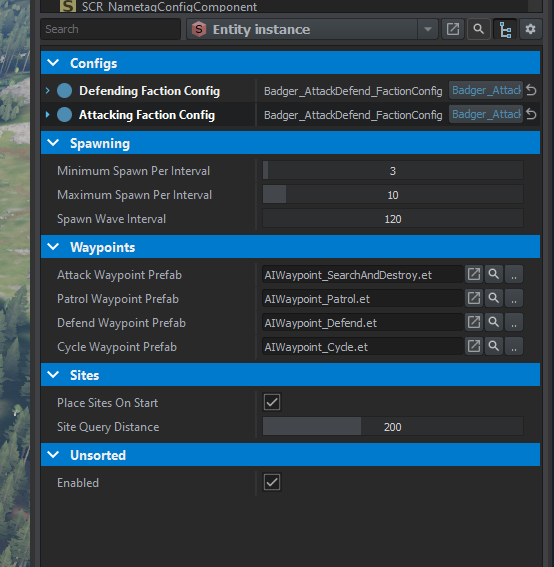
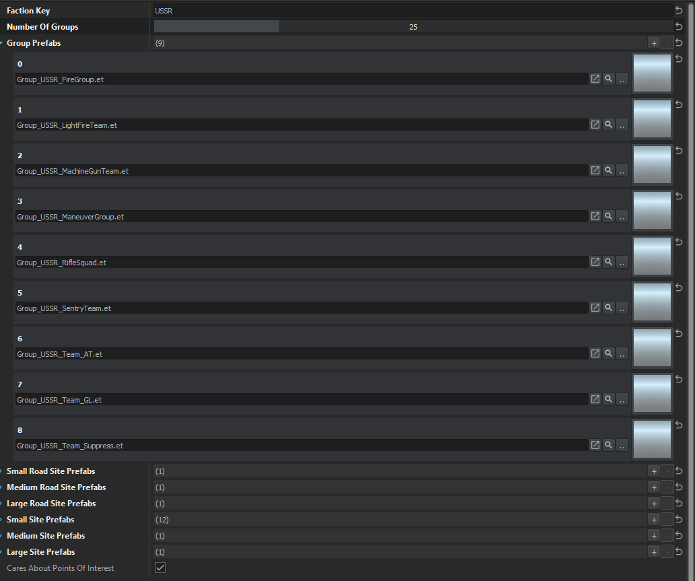

# Faction Config
To eliminate the attribute/property soup we'll utilize config files! This also makes swapping out a set of values a bit cleaner / easier in the long run as well.

We may even simplify it further by separating site-compositions into another config! 

```csharp
[BaseContainerProps(configRoot: true)] // This is required in order to inform the engine this is a config file
class Badger_AttackDefend_FactionConfig
{
    // All the values we want in our config go here
    [Attribute("", UIWidgets.EditBox, "Faction Key", category: "Basic Info")]
	private FactionKey m_pFactionKey;		
	
	[Attribute("1", UIWidgets.Slider, desc: "Number of groups to maintain overtime", params: "1, 100, 1", category: "Basic Info")]
	private int m_iNumberOfGroups;
	
	[Attribute("", UIWidgets.ResourcePickerThumbnail, desc: "Group Prefabs to spawn", params: "et", category: "Basic Info")]
	private ref array<ResourceName> m_aGroupPrefabs;
	
	[Attribute("", UIWidgets.ResourcePickerThumbnail, desc: "Small road site prefabs of controlled areas", category: "Sites: Road Prefabs")]
	private ref array<ResourceName> m_aSmallRoadSitePrefabs;
	
	[Attribute("", UIWidgets.ResourcePickerThumbnail, desc: "Medium road site prefabs of controlled areas", category: "Sites: Road Prefabs")]
	private ref array<ResourceName> m_aMediumRoadSitePrefabs;
	
	[Attribute("", UIWidgets.ResourcePickerThumbnail, desc: "Large road site prefabs of controlled areas", category: "Sites: Road Prefabs")]
	private ref array<ResourceName> m_aLargeRoadSitePrefabs;
	
	[Attribute("", UIWidgets.ResourcePickerThumbnail, desc: "Small site prefabs of controlled areas", category: "Sites: Site Prefabs")]
	private ref array<ResourceName> m_aSmallSitePrefabs;
	
	[Attribute("", UIWidgets.ResourcePickerThumbnail, desc: "Medium site prefabs of controlled areas", category: "Sites: Site Prefabs")]
	private ref array<ResourceName> m_aMediumSitePrefabs;
	
	[Attribute("", UIWidgets.ResourcePickerThumbnail, desc: "Large site prefabs of controlled areas", category: "Sites: Site Prefabs")]
	private ref array<ResourceName> m_aLargeSitePrefabs;
	
	[Attribute("1", UIWidgets.CheckBox, desc: "Cares about Points of Interest", category: "POI")]
	private bool m_CaresAboutPointsOfInterest;
	
	FactionKey GetFactionKey() { return m_pFactionKey; }
	int GetNumberOfGroups() { return m_iNumberOfGroups; }
	bool CaresAboutPointsOfInterest() { return m_CaresAboutPointsOfInterest; }

	/*
		Since we're only using this to obtain random elements from these arrays we'll
		create that functionality and expose it versus exposing our arrays directly
	*/
	ResourceName GetRandomGroupPrefab() 
	{ 
		if(!m_aGroupPrefabs || m_aGroupPrefabs.IsEmpty()) return ResourceName.Empty;		
		return m_aGroupPrefabs.GetRandomElement(); 
	}
	
	ResourceName GetRandomSmallCheckpointPrefab() 
	{ 
		if(!m_aSmallRoadSitePrefabs || m_aSmallRoadSitePrefabs.IsEmpty()) return ResourceName.Empty;
		return m_aSmallRoadSitePrefabs.GetRandomElement(); 
	}
	
	ResourceName GetRandomMediumCheckpointPrefab() 
	{ 
		if(!m_aMediumRoadSitePrefabs || m_aMediumRoadSitePrefabs.IsEmpty()) return ResourceName.Empty;
		return m_aMediumRoadSitePrefabs.GetRandomElement(); 
	}
	
	ResourceName GetRandomLargeCheckpointPrefab() 
	{ 
		if(!m_aLargeRoadSitePrefabs || m_aLargeRoadSitePrefabs.IsEmpty()) return ResourceName.Empty;
		return m_aLargeRoadSitePrefabs.GetRandomElement(); 
	}
	
	ResourceName GetRandomSmallSitePrefab() 
	{
		if(!m_aSmallSitePrefabs || m_aSmallSitePrefabs.IsEmpty()) return ResourceName.Empty;
		 return m_aSmallSitePrefabs.GetRandomElement(); 
	}
	
	ResourceName GetRandomMediumSitePrefab() 
	{ 
		if(!m_aMediumSitePrefabs || m_aMediumSitePrefabs.IsEmpty()) return ResourceName.Empty;
		return m_aMediumSitePrefabs.GetRandomElement(); 
	}
	
	ResourceName GetRandomLargeSitePrefab() 
	{ 
		if(!m_aLargeSitePrefabs || m_aLargeSitePrefabs.IsEmpty()) return ResourceName.Empty;
		return m_aLargeSitePrefabs.GetRandomElement(); 
	}
}
```

# Config Creation
In the resource browser we can now 

`Right Click --> Config File --> "give it a name you want" --> Badger_AttackDefend_FactionConfig`



# Config Usage

Using our config is actually simple... First we'll want to expose our config to the editor, and limit the config class type to our custom one! We don't want just ANY config...

To limit the class-type we need to set the `conf class` equal to the target type. In our case it's `Badger_AttackDefend_FactionConfig`.

```csharp
[Attribute("", UIWidgets.Object, params: "conf class=Badger_AttackDefend_FactionConfig", category: "Configs")]
private ref Badger_AttackDefend_FactionConfig m_defendingFactionConfig;
```

Unfortunately I wasn't able to get this working as an array. Would have been nice in certain use-cases to add multiple configs for something. Oh well... Could also be possible and I just didn't figure it out yet.



By default, the property will be empty and it'll let you create a config item. Or, you can simply drag and drop an existing config from the `Resource Browser` onto the `property`. 

