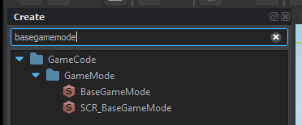
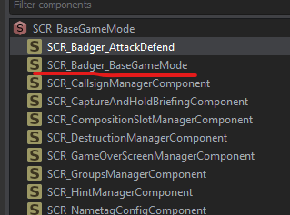

# Base Gamemode
For my purposes I just want to create a gamemode class that can store `SpawnAreas` as well as `Points of Interest` along with appropriate APIs to register/unregister amongst a few other things.

```csharp
[EntityEditorProps(category: "GameScripted/Gamemode", description: "Badger's basic game-mode.", color: "0 0 255 255")]
class SCR_Badger_BaseGameModeClass : SCR_BaseGameModeComponentClass
{
};

class SCR_Badger_BaseGameMode : SCR_BaseGameModeComponent
{
    // Actual code will go here
};
```

This is all we need to make this class appear in the Enfusion Editor as a component we can add to `SCR_BaseGameMode`.

1. Place a `SCR_BaseGameMode` into the world.


2. Click on the `SCR_BaseGameMode` entity and `AddComponent`
3. Select `SCR_Badger_BaseGameMode`, or whatever you called yours... if you're following along...

Now you should have it appear in the entity hierarchy


## Singleton
This will behave as a centralized place for any other subsystem. For my uses I'd like to store Faction `SpawnAreas` along with `Points of Interest`. Both of these are entities which will automatically register themselves which will require an API. So lets get cracking....

External entities will need a way to access our gamemode API. There should only ever be **one** instance. Thus, a singleton approach is perfect.

```csharp
// Singleton, assigned on first 'get'
static SCR_Badger_BaseGameMode s_pInstance;

// Retrieves existing instance of gamemode, if it exists...
SCR_Badger_BaseGameMode GetInstance()
{
    BaseGameMode gameMode = GetGame().GetGameMode();
    if(!gameMode) return null;

    if(!s_pInstance)
        s_pInstance = SCR_Badger_BaseGameMode.Cast(gameMode.FindComponent(SCR_Badger_BaseGameMode));

    return s_pInstance;
}
```

## Spawn Areas
We need the ability to both register and unregister a spawn area.

```csharp
private ref map<Faction, ref array<SCR_Badger_SpawnArea>> m_FactionSpawnAreas = new map<Faction, ref array<SCR_Badger_SpawnArea>>();

void RegisterSpawnArea(SCR_Badger_SpawnArea spawnArea)
{
    if(!GetGame().GetFactionManager())
    {
        Print("Could not locate faction manager. Unable to register spawn area", LogLevel.ERROR);
        return;
    }

    Faction areaFaction = GetGame().GetFactionManager().GetFactionByKey(spawnArea.GetAffiliatedFactionKey());

    if(!areaFaction) return;

    if(!m_FactionSpawnAreas.Contains(areaFaction))
        m_FactionSpawnAreas.Insert(areaFaction, new array<SCR_Badger_SpawnArea>());
    
    m_FactionSpawnAreas.Get(areaFaction).Insert(spawnArea);
    Print(string.Format("%1 has %2 spawn areas now...", areaFaction.GetFactionName(), m_FactionSpawnAreas.Get(areaFaction).Count()), LogLevel.DEBUG);
}

void UnregisterSpawnArea(SCR_Badger_SpawnArea spawnArea)
{
    if(!GetGame().GetFactionManager())
    {
        Print("Could not locate faction manager. Unable to unregister spawn area", LogLevel.ERROR);
        return;    
    }

    Faction areaFaction = GetGame().GetFactionManager().GetFactionByKey(spawnArea.GetAffiliatedFactionKey());

    if(!areaFaction) return;
    if(!m_FactionSpawnAreas.Contains(areaFaction)) return;

    int indexOf = m_FactionSpawnAreas.Get(areaFaction).Find(spawnArea);

    if(indexOf != -1)
        m_FactionSpawnAreas.Get(areaFaction).Remove(indexOf);
}
```

Now that we have the ability to add/remove spawn areas we also need a way to access them!

```csharp
// Gets the number of spawn areas that are being tracked for a given faction
int GetSpawnAreaCountFor(FactionKey factionKey)
{
    if(!factionKey) return 0;
    Faction faction = GetGame().GetFactionManager().GetFactionByKey(factionKey);

    if(!faction) return 0;
    if(!m_FactionSpawnAreas.Contains(faction)) return 0;

    return m_FactionSpawnAreas.Get(faction).Count();
}

// Populate a given array with the spawn areas of a given faction (if applicable), and return the # of spawn areas
int GetSpawnAreasFor(notnull array<SCR_Badger_SpawnArea> outAreas, FactionKey factionKey)
{
    if(!factionKey)
    {
        Print("[SCR_Badger_BaseGameMode] <GetSpawnAreasFor>: FactionKey cannot be null. Returning 0", LogLevel.ERROR);
        return 0;
    }

    Faction faction = GetGame().GetFactionManager().GetFactionByKey(factionKey);

    if(!faction)
    {
        Print(string.Format("[SCR_Badger_BaseGameMode] <GetSpawnAreasFor>: Could not locate faction with key %1", factionKey), LogLevel.ERROR);
        return 0;
    }

    int count = 0;
    foreach(SCR_Badger_SpawnArea spawnArea : m_FactionSpawnAreas.Get(faction))
    {
        outAreas.Insert(spawnArea);
        count++;
    }

    return count;
}

// Return a random spawn area from a given faction
SCR_Badger_SpawnArea GetRandomSpawnAreaFor(FactionKey factionKey)
{
    if(!factionKey)
    {
        Print("[SCR_Badger_BaseGameMode] <GetRandomSpawnAreaFor>: Faction key is null. Returning nothing");
        return null;
    }

    Faction faction = GetGame().GetFactionManager().GetFactionByKey(factionKey);

    if(!faction)
    {
        Print(string.Format("[SCR_Badger_BaseGameMode] <GetRandomSpawnAreaFor>: Could not locate faction with key %1", factionKey), LogLevel.ERROR);
        return null;
    }

    if(!m_FactionSpawnAreas.Contains(faction)) return null; // if we're not tracking that faction...

    return m_FactionSpawnAreas.Get(faction).GetRandomElement();
}
```

## Point of interest

Just like our spawn areas we need the same type of API to register, unregister, retrieve and such....

```csharp
private ref array<SCR_Badger_POI> m_PointsOfInterest = {};

// Retrieve # of POIs being tracked
int PointsOfInterestCount() { return m_PointsOfInterest.Count(); }

// Loads points of interest into `outArray` and returns # of POIs
int GetPointsOfInterest(notnull array<SCR_Badger_POI> outArray)
{
    int count = 0;

    foreach(SCR_Badger_POI area : m_PointsOfInterest)
    {
        outArray.Insert(area);
        count++;
    }

    return count;
}

// Return a random POI.
SCR_Badger_POI GetRandomPointOfInterest()
{
    if(m_PointsOfInterest.IsEmpty()) return null;
    return m_PointsOfInterest.GetRandomElement();
}

// Retrieve the areas held by a given faction, in `areas`. Return # of POIs held.
int GetPointsOfInterestHeldBy(notnull array<SCR_Badger_POI> areas, FactionKey factionKey)
{
    int count = 0;

    foreach(SCR_Badger_POI area : m_PointsOfInterest)
    {
        if(area.GetOwningFaction().GetFactionKey() != factionKey)
            continue;
        
        areas.Insert(area);
        count++;
    }

    return count;
}

// Registers a POI to the game mode
void RegsterPOI(SCR_Badger_POI area)
{
    if(!area) return;
    m_PointsOfInterest.Insert(area);
}

// Unregisters / removes POI from game mode
void UnregisterPOI(SCR_Badger_POI area)
{
    if(!area) return;
    int indexOf = m_PointsOfInterest.Find(area);

    if(indexOf != -1)
        m_PointsOfInterest.Remove(indexOf);
}
```

## In closing

That's pretty much all the functionality we need in our basic gamemode system.