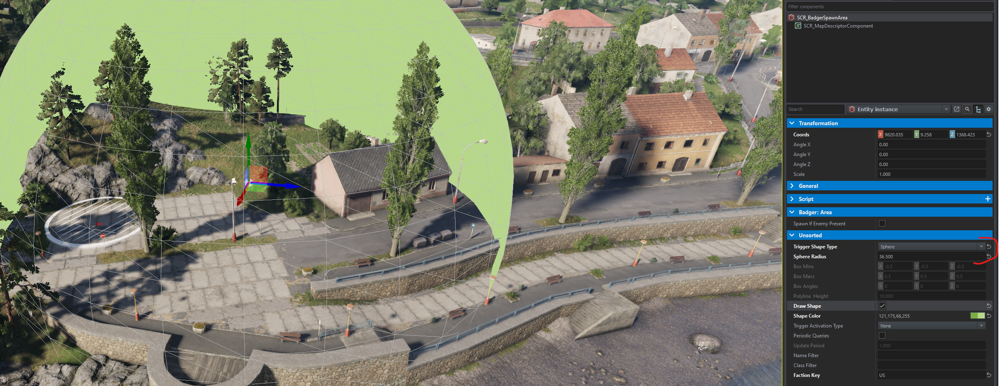

# Spawn Area
Our spawn area needs to register itself to our basic game mode `SCR_Badger_BaseGameMode`. This allows other subsystems to utilize our spawn area!

Not a lot of stuff is needed here....

```csharp
[EntityEditorProps(category: "GameScripted/GameMode/Badger", description: "Defines a spawn area for a given side")]
class SCR_Badger_SpawnAreaClass : SCR_SpawnAreaClass
{
}

class SCR_Badger_SpawnArea : SCR_SpawnArea
{
    FactionKey GetFaction() { return GetAffiliatedFactionKey(); }

    // View figure for more details
    int GetSpawnRadius() { return GetSphereRadius(); }

    protected override void OnInit(IEntity owner)
    {
        super.OnInit(owner);

        if(!GetGame().InPlayMode())
            return;

        // Register
        SCR_Badger_BaseGameMode badger = SCR_Badger_BaseGameMode.GetInstance();

        if(!badger)
        {
            Print("[SCR_Badger_SpawnArea] <OnInit> Cannot find SCR_Badger_BaseGameMode! Functionality will be limited", LogLevel.ERROR);
            return;
        }

        badger.RegisterSpawnArea(this);
    }
}
```

